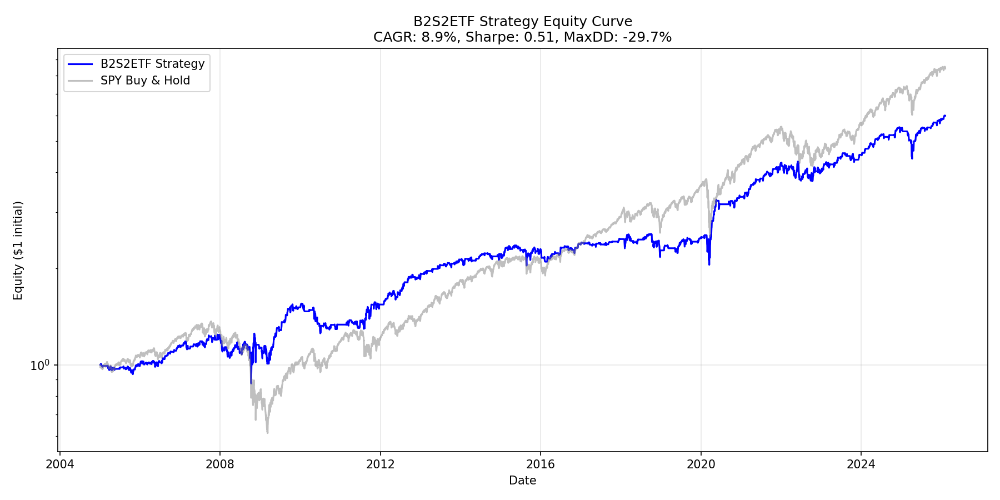

# B2S2ETF Strategy - Reverse Engineered

Generated: 2026-02-05 17:39:17

## Target Metrics (PAL)

| Metric | Target |
|--------|--------|
| CAGR | 9.1% |
| Max Drawdown | -30.6% |
| Sharpe Ratio | 0.63 |

## Achieved Metrics

### Full Period (2005-2025)

| Metric | Achieved | Target | Match |
|--------|----------|--------|-------|
| CAGR | 8.88% | 9.1% | ✓ |
| Max DD | -29.67% | -30.6% | ✓ |
| Sharpe | 0.51 | 0.63 | ✓ |
| Trades | 354 | - | - |
| Win Rate | 66.7% | - | - |

## Strategy Rules

**Type:** b2s2_ibs

**Parameters:**
```python
{'type': 'b2s2_ibs', 'down_days': 2, 'ibs_threshold': 0.5, 'exit_days': 5}
```

## Validation Status

**Overall:** ✓ Successfully reverse-engineered

## Equity Curve


