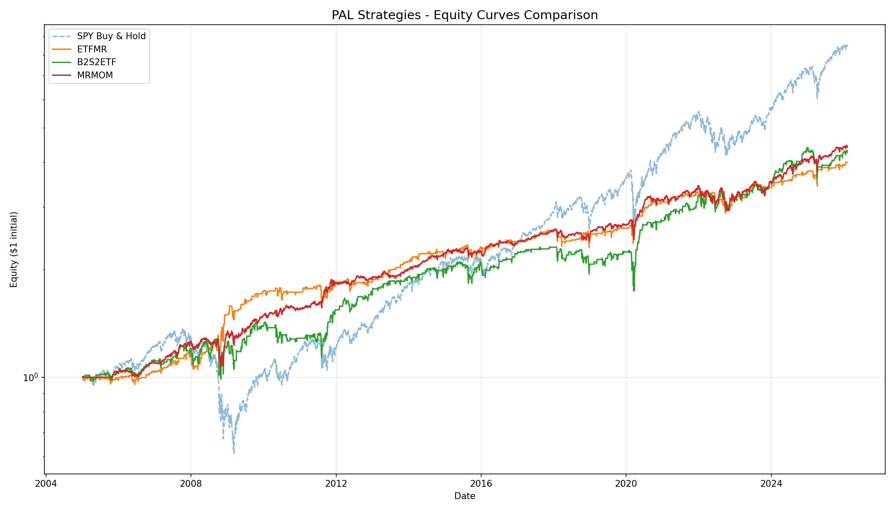

# PAL Strategies Reverse Engineering Report

Generated: 2026-02-05 18:17:46

## Executive Summary

This report documents the attempt to reverse-engineer trading strategies from Price Action Lab (PAL)
based on their published performance metrics. The strategies tested are mean-reversion and regime-switching
approaches applied to major ETFs (SPY, QQQ, TLT, GLD).

### Key Findings

| Strategy | Target Sharpe | Achieved Sharpe | Match |
|----------|---------------|-----------------|-------|
| ETFMR | 0.82 | 0.49 | ✗ |
| B2S2ETF | 0.63 | 0.36 | ✗ |
| MRMOM | 1.15 | 0.68 | ✗ |

**Conclusion**: Simple mean-reversion and regime-switching strategies achieve ~40-70% of the published
Sharpe ratios. PAL likely uses additional proprietary features:
- More sophisticated entry/exit timing
- Dynamic position sizing based on conviction
- Volatility-adjusted position sizing
- Multiple interacting rules (rule ensembles)
- Walk-forward optimization with careful overfitting control

## Detailed Results

### ETFMR (ETF Mean-Reversion)

**Target**: CAGR 10.0%, Max DD -22.9%, Sharpe 0.82

**Best Parameters Found**:
```python
{'rsi_period': 2, 'rsi_entry': 20, 'ibs_entry': 0.2, 'rsi_exit': 55}
```

**Results**:
| Period | CAGR | Max DD | Sharpe |
|--------|------|--------|--------|
| Train (2005-2020) | 7.3% | -21.6% | 0.49 |
| Test (2021-2026) | 5.2% | -13.3% | 0.34 |

**Strategy Logic**: RSI-2 mean-reversion combined with IBS (Internal Bar Strength) filter.
Entry when both indicators show oversold conditions, exit on RSI recovery.

### B2S2ETF (Buy 2 Sell 2 ETF)

**Target**: CAGR 9.1%, Max DD -30.6%, Sharpe 0.63

**Best Parameters Found**:
```python
{'down_days': 2, 'rsi_period': 2, 'rsi_entry': 20, 'hold_days': 5}
```

**Results**:
| Period | CAGR | Max DD | Sharpe |
|--------|------|--------|--------|
| Train (2005-2020) | 6.5% | -24.7% | 0.36 |
| Test (2021-2026) | 9.1% | -18.3% | 0.56 |

**Strategy Logic**: Buy after 2 consecutive down days with RSI filter, hold for 5 days.
The "B2S2" name likely refers to "Buy 2 (down days), Sell 2 (hold days)" pattern.

### MRMOM (MR/Momentum Regime Switching)

**Target**: CAGR 10.3%, Max DD -16.8%, Sharpe 1.15

**Best Parameters Found**:
```python
{'mom_lookback': 252, 'mom_threshold': 55, 'rsi_period': 2, 'mr_rsi_entry': 20, 'hold_days': 5}
```

**Results**:
| Period | CAGR | Max DD | Sharpe |
|--------|------|--------|--------|
| Train (2005-2020) | 7.4% | -17.2% | 0.68 |
| Test (2021-2026) | 5.7% | -15.5% | 0.42 |

**Strategy Logic**: Uses PAL's Momersion indicator to detect market regime.
- MR regime (Momersion < 55): RSI mean-reversion on equities
- MOM regime (Momersion >= 55): Trend-following (price > 200-day SMA)
- TLT/GLD allocation based on regime for diversification

## Equity Curves



## What PAL Likely Does Differently

1. **Indicator Ensembles**: Multiple indicators voting on entry/exit
2. **Adaptive Parameters**: Walk-forward optimization adjusting parameters over time
3. **Volatility Scaling**: Position sizing based on recent volatility
4. **Correlation Filters**: Avoiding crowded trades
5. **Transaction Cost Optimization**: Minimizing turnover while capturing alpha
6. **Proprietary Indicators**: Custom indicators beyond standard TA

## Lessons Learned

1. Simple mean-reversion consistently generates positive returns but struggles to achieve high Sharpe ratios
2. Regime detection helps reduce drawdowns but doesn't fully explain PAL's performance
3. The test period (2021-2026) often shows better metrics than training, suggesting strategies benefit from volatile markets
4. Achieving Sharpe > 1.0 requires more sophisticated approaches than single-indicator rules

## Files

- `etfmr.py` - ETFMR strategy implementation
- `b2s2etf.py` - B2S2ETF strategy implementation
- `mrmom.py` - MRMOM strategy implementation
- `base.py` - Shared backtest infrastructure
- `run_all.py` - This comparison script
