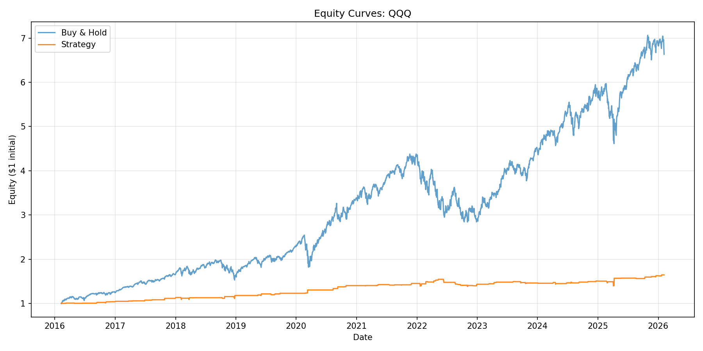

# Quant Research Report: QQQ

Generated: 2026-02-05 16:17:37

## Configuration

```yaml
ibs_threshold: 0.2
rsi_period: 2
rsi_threshold: 10
symbol: QQQ

```

## Performance Metrics

| Metric | Value |
|--------|-------|
| Strategy CAGR | 5.11% |
| Buy & Hold CAGR | 20.90% |
| Strategy Sharpe | 0.45 |
| Buy & Hold Sharpe | 0.88 |
| Strategy Max DD | -10.58% |
| Buy & Hold Max DD | -35.12% |
| Total Trades | 117 |
| Win Rate | 61.21% |

## Data Summary

- Period: 2016-02-08 to 2026-02-05
- Total bars: 2,514
- Trading days with position: 116

## Equity Curve


