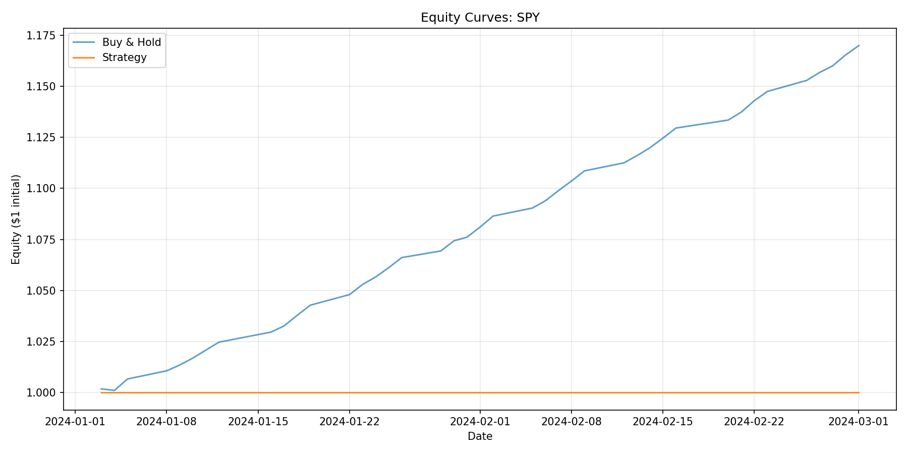

# Quant Research Report: SPY

Generated: 2026-02-05 16:17:31

## Configuration

```yaml
ibs_threshold: 0.2
rsi_period: 2
rsi_threshold: 10
symbol: SPY

```

## Performance Metrics

| Metric | Value |
|--------|-------|
| Strategy CAGR | 0.00% |
| Buy & Hold CAGR | 162.36% |
| Strategy Sharpe | 0.00 |
| Buy & Hold Sharpe | 52.77 |
| Strategy Max DD | 0.00% |
| Buy & Hold Max DD | -0.07% |
| Total Trades | 0 |
| Win Rate | nan% |

## Data Summary

- Period: 2024-01-02 to 2024-03-01
- Total bars: 42
- Trading days with position: 0

## Equity Curve


